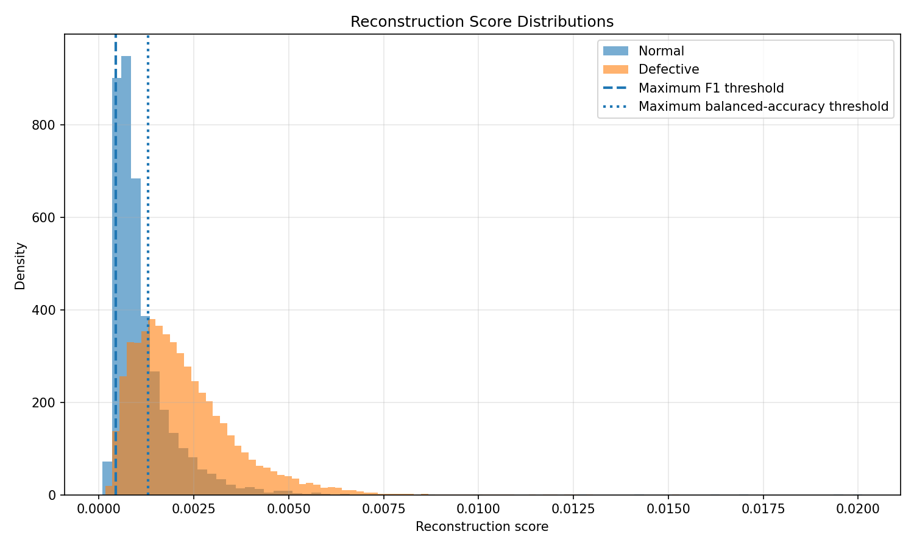
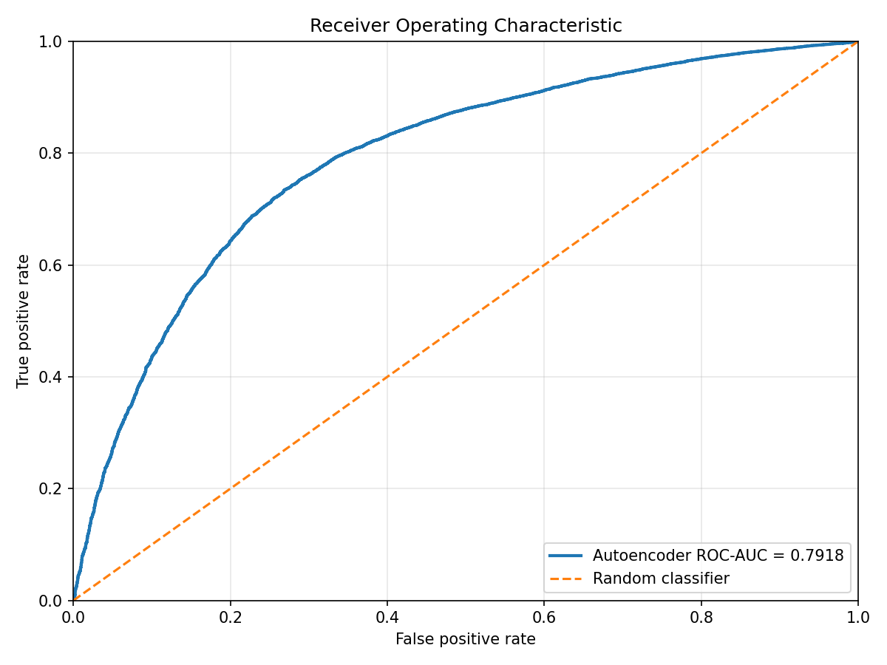
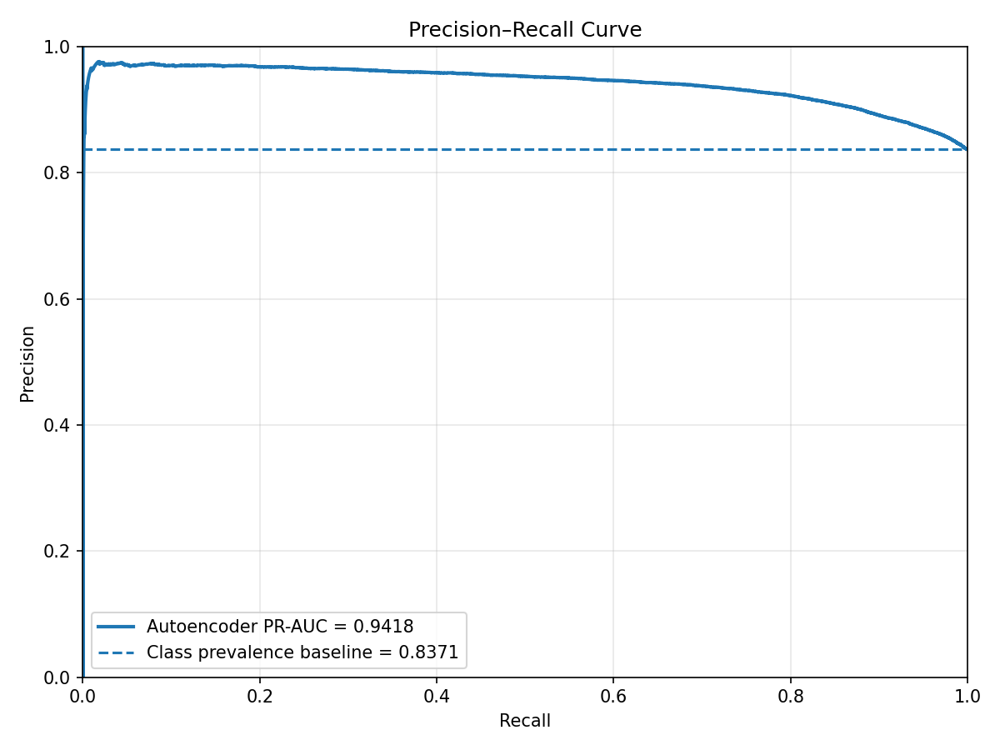
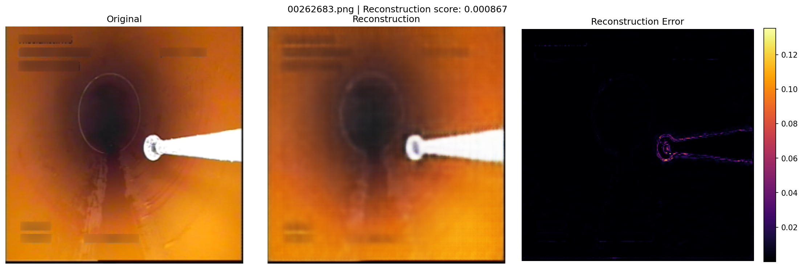
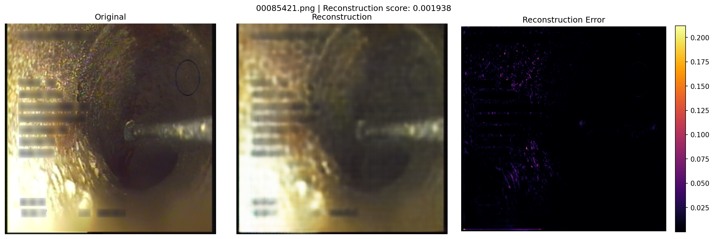

# Sewer Pipe Anomaly Detection

Industrial sewer pipe anomaly detection using a convolutional autoencoder, reconstruction scores, threshold evaluation, and reconstruction-error heatmaps.

## Overview

This project implements an end-to-end anomaly detection pipeline for Sewer-ML inspection images.

The autoencoder is trained only on images labelled as normal. During inference, it reconstructs each image and calculates the mean squared reconstruction error. Images with larger reconstruction errors are treated as more likely to contain unusual visual structures.

A high reconstruction error does not prove that a pipe defect is present. The model may also react to camera equipment, antennas, reflections, joints, dirt, lighting changes, and other structures that differ from the training data.

## Pipeline

```text
Sewer-ML image
      |
      v
Resize to 256 x 256 and normalize to [0, 1]
      |
      v
Convolutional autoencoder
      |
      v
Reconstructed image
      |
      +--------------------------+
      |                          |
      v                          v
Image-level MSE score    Pixel-level error heatmap
      |
      v
Threshold classification
```

## Implemented Features

- Sewer-ML metadata analysis and manifest generation
- Deterministic normal-image training and validation split
- RGB preprocessing with OpenCV
- Convolutional encoder-decoder model
- YAML-based training configuration
- CUDA and CPU support
- Checkpoint saving and loading
- Reconstruction-score evaluation
- F1 and balanced-accuracy threshold selection
- ROC-AUC and PR-AUC evaluation
- Score-distribution, ROC, and precision-recall plots
- Pixel-level reconstruction-error heatmaps
- Ruff, mypy, and pytest validation

## Dataset

The dataset is not included in this repository and must be obtained separately under the Sewer-ML license and access conditions.

The current baseline uses the locally available `valid00` images.

| Dataset portion | Samples |
|---|---:|
| Normal training images | 25,671 |
| Normal validation images | 6,418 |
| Defective evaluation images | 32,988 |
| Total scored images | 39,406 |

The class labels come from the Sewer-ML metadata. An image labelled as normal may still contain camera equipment, antennas, dirt, reflections, joints, or other visually unusual structures.

## Model and Training

The baseline model is a convolutional autoencoder with RGB `256 x 256` input images and a 128-channel latent representation.

Training configuration:

```text
configs/train_autoencoder_normal_smoke.yaml
```

| Parameter | Value |
|---|---:|
| Epochs | 3 |
| Batch size | 8 |
| Learning rate | 0.001 |
| Latent channels | 128 |
| Optimizer | Adam |

| Epoch | Training loss | Validation loss |
|---:|---:|---:|
| 1 | 0.003749 | 0.001803 |
| 2 | 0.001953 | 0.001141 |
| 3 | 0.001476 | 0.001265 |

The best checkpoint was selected at epoch 2.

## Results

Mean reconstruction scores:

| Class | Mean score |
|---|---:|
| Normal | 0.001141 |
| Defective | 0.002218 |

Defective-labelled images produced approximately 1.94 times the mean reconstruction error of normal-labelled images.



### Threshold Comparison

| Metric | Maximum F1 | Balanced accuracy |
|---|---:|---:|
| Threshold | 0.00044845 | 0.00129162 |
| Precision | 0.848923 | 0.932963 |
| Recall | 0.986601 | 0.732388 |
| Specificity | 0.097538 | 0.729511 |
| Balanced accuracy | 0.542070 | 0.730949 |
| F1-score | 0.912598 | 0.820596 |

The maximum-F1 threshold prioritizes recall and detects most defective-labelled images, but it also produces many false positives.

The balanced-accuracy threshold provides a more even trade-off between recall and specificity.

### Ranking Metrics

| Metric | Value |
|---|---:|
| ROC-AUC | 0.792952 |
| PR-AUC | 0.941666 |





## Reconstruction-Error Heatmaps

Reconstruction-error heatmaps show where the autoencoder fails to reproduce an input image.

They do not directly identify pipe defects. A bright region may represent:

- a real pipe defect;
- an antenna or another part of the inspection equipment;
- a reflection or lighting change;
- dirt or water;
- a pipe joint;
- another visual structure not reconstructed well by the model.

### Lower-Score Example

Reconstruction score: `0.000867`



The heatmap may still react to inspection equipment or other unusual structures even though the image has a relatively low reconstruction score.

### Higher-Score Example

Reconstruction score: `0.001938`



The higher score indicates a larger difference between the input and reconstruction. It does not prove that every highlighted region is a pipe defect.

These heatmaps are anomaly indicators, not ground-truth defect segmentation masks.

## Project Structure

```text
sewer-pipe-anomaly-detection/
├── configs/
├── data/
├── docs/
│   └── images/
│       └── results/
├── outputs/
├── scripts/
├── src/
│   └── sewer_anomaly/
│       ├── config/
│       ├── data/
│       ├── evaluation/
│       ├── inference/
│       ├── models/
│       ├── training/
│       └── visualization/
├── tests/
├── Makefile
├── pyproject.toml
├── README.md
└── requirements-dev.txt
```

## Installation

Run from the project root:

```bash
python -m pip install -r requirements-dev.txt
```

## Usage

Train the normal-only autoencoder:

```bash
python scripts/train_autoencoder.py \
  --config configs/train_autoencoder_normal_smoke.yaml
```

Calculate reconstruction scores:

```bash
python scripts/evaluate_normal_only_scores.py
```

Select an anomaly threshold:

```bash
python scripts/select_anomaly_threshold.py
```

Evaluate threshold strategies:

```bash
python scripts/evaluate_anomaly_threshold.py
```

Generate evaluation plots:

```bash
python scripts/generate_anomaly_visualizations.py
```

Generate reconstruction-error heatmaps:

```bash
python scripts/generate_reconstruction_heatmaps.py
```

## Quality Checks

```bash
make check
```

Current status:

```text
Ruff passed
mypy passed
142 tests passed
```

## Limitations

- Training was limited to three epochs.
- Only the locally available `valid00` images were used.
- Normal and defective score distributions overlap.
- Sewer-ML labels do not guarantee visually clean normal images.
- Reconstruction heatmaps may highlight inspection equipment and image artifacts.
- Heatmaps are not supervised defect masks.
- No systematic hyperparameter optimization was performed.
- No external test dataset was evaluated.

## License

The source code is licensed under the MIT License.

The Sewer-ML dataset has its own license and is not redistributed by this repository.

## Author

William Popkov
